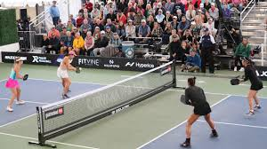
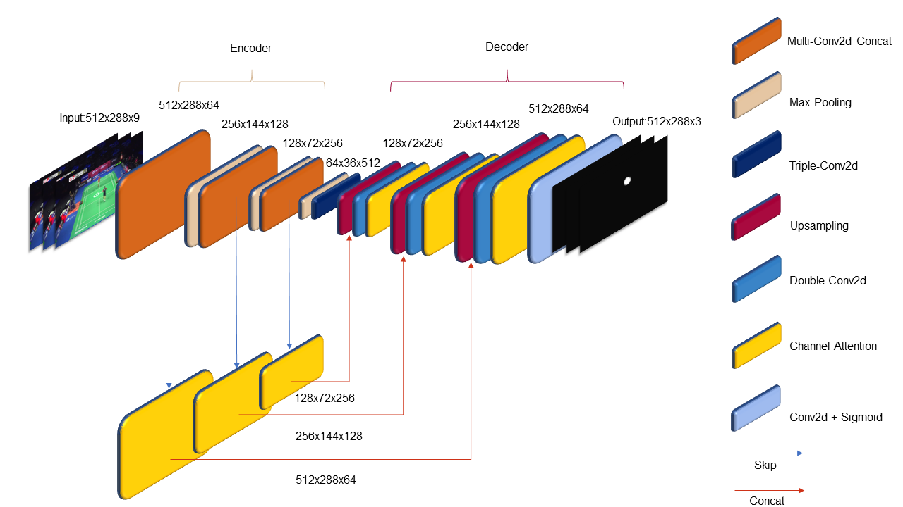

# AI-Powered Pickleball Tracking Using Transfer Learning on TrackNetV3  



## 📝 Abstract  
This project adapts **TrackNetV3**, a state-of-the-art deep learning model for tennis/badminton ball tracking, to track pickleballs using **transfer learning**. By fine-tuning the model on a custom dataset of annotated pickleball match footage, we achieve robust performance in detecting pickleball trajectories under diverse conditions (lighting, occlusions, motion blur). The solution addresses the lack of cost-effective tracking tools in pickleball, enabling automated performance analytics for players and coaches.  

---

## 🚀 Key Features  
- **TrackNetV3 Architecture**: Enhanced with **Multiple Convolution Concatenation (MCC)** and **Channel Attention Mechanisms** for multi-scale feature extraction.  
- **Transfer Learning**: Fine-tuned on a custom pickleball dataset to adapt to unique ball dynamics (slower speed, unpredictable bounces).  
- **Heatmap-Based Detection**: Predicts Gaussian heatmaps for precise ball localization.  
- **Cost-Effective & Scalable**: Eliminates reliance on expensive hardware like Hawk-Eye systems.  
- **Performance Metrics**: Achieved **91.2% accuracy**, **0.78 IoU**, and **0.74 AP** after fine-tuning.  

---
## 📁 Dataset
The dataset used in this project was generated by extracting frames from a video and manually labeling them. It is stored in a shared Google Drive folder and can be accessed via the link below:
[Download Dataset from Google Drive](https://drive.google.com/drive/folders/1TW3EcclB4njtOcw4UowNJrdEbKxpIDNN?usp=sharing)

###🧾 Dataset Details
- **Source**: Converted from YouTube videos to frames  
- **Format**: Image frames (PNG) + annotation file (CSV)  
- **Labeling Tool Used**: *[Add name like CVAT, LabelImg, etc.]*  
- **Total Frames**: *970*  
- **Labels**:
  - `Visibility`: 1 (visible), 0 (not visible)
  - `X`, `Y`: Coordinates of the pickleball per frame  

## Model Architecture  

- **TrackNetV3**: U-Net-style encoder-decoder with MCC layers and skip connections.  
  - **MCC Layers**: Parallel 1x1, 3x3, 5x5 convolutions for multi-scale feature extraction.  
  - **Channel Attention**: Dynamically weights feature maps to suppress noise.  
- **Transfer Learning**:  
  - Initialized with pretrained weights (badminton dataset).  
  - Fine-tuned last 14 convolutional layers on pickleball data.  

## Training  
- **Hyperparameters**: Learning rate = 0.01, batch size = 32, Adam optimizer.  
- **Loss Function**: Weighted Binary Cross Entropy (WBCE) for heatmap prediction.  

---

## ⚙️ Installation  
1. **Prerequisites**:  
   - Python 3.8+  
   - TensorFlow 2.10+  
   - OpenCV  
   - NumPy  

2. **Clone Repository**:  
   ```bash  
   git clone https://github.com/yourusername/pickleball-tracking.git  
   cd pickleball-tracking

3. **Install Dependencies**:
   ```bash
    pip install -r requirements.txt  

## 🖥️ Implementation
1. **Data Preparation**:
   Extract frames from videos:
    python utils/extract_frames.py --video_path matches/ --output_dir dataset/  
